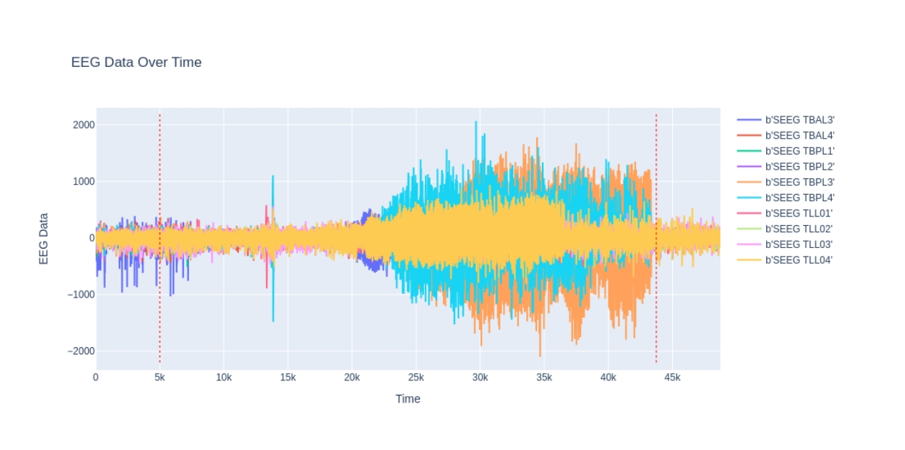

# Epilepsy Detection for EEG signals using Time-Frequency Analysis and Network Metrics

Project done as part of a team for the course Dynamical Processes in Complex Networks at IIIT Hyderabad.

## Introduction
Epilepsy is a chronic neurological disorder characterized by recurrent seizures, which are abnormal
electrical activities in the brain. Electroencephalography (EEG) is a widely used non-invasive technique
for monitoring brain activity and diagnosing epilepsy.
However, accurate and automated detection of epilepsy from EEG signals remains a challenging task due to the complex and dynamic nature of brain signals

We explore the potential of GSP and S-Transform as promising tools for improving
the accuracy and efficiency of epilepsy detection from EEG signals. 

## Objective
Classification(Detection) Task - Given a small chunk of time-series data corresponding to electrodes.
Classify(detect) if a person is undergoing epiliptic seizures.

## Data

We perform the analysis over 10 subjects, each of varying lengths of seizure. The data consists of Time-Series Data for electrodes that measure signal/activation in certain regions
of the brain.

There are 58 distinct electrodes for measurement, but unfortunately certain noisy ones had to be
dropped for certain subjects.

## Experiments

For a detailed report on the experiments, refer to the `report.pdf` file.

### Experiment 1: Raw Data
We use the raw data directly for our purpose to answer the question - given a small chunk pf electrode
readings, is the subject undergoing epiliptic seizure or not.

### Experiment 2: Theta Band Pass Filter
We use the theta band pass filter to extract the theta band oscillations from the EEG signal. We then use a CNN to classify the 2D data.

### Experiment 3: Time Frequency Analysis

We explore the application of time-frequency analysis on 3D data for automated
seizure detection in epilepsy patients. We employ CNN and MLP architectures to classify the data.

### Experiment 4: Graph Signal Processing and Graph Learning

We consider the time-series signals from electrodes as Graph Signals, in order to understand the relationship between the electrodes, we use a graph learning module to learn the connectivity matrices. These connectivity matrices form the features for a CNN.

### Experiment 5:  Network metrics

We use the connectivity matrices obtained from the graph learning module to extract network metrics. These metrics are then used as features for classification.

### Experiment 6: Finding Important Nodes and Trends

We analyze the trends in network metrics and find the most important nodes in the network. Important Nodes are defined as the nodes whose network metrics are of the most useful. In other words,
the top few node whose network metric information give the highest accuracy for the classification task

## Results

Check the `report.pdf` for detailed results and analysis. Our best approach was the Graph Signal Processing and Graph Learning approach with the Network Metric - Closeness Centrality as the feature for classification. We achieved an accuracy of **$84.32$%** on the test set.
M